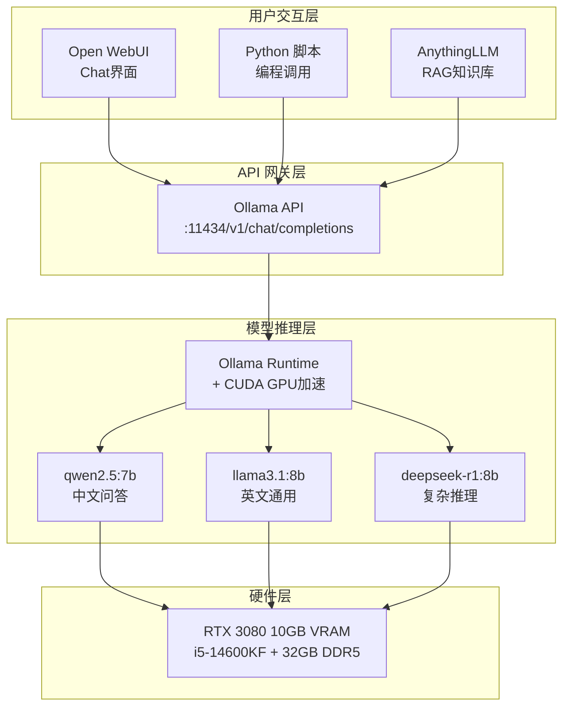

# 我的 AI 工具链总结

> 记录时间：2026年7月 | 状态：持续更新

## 概述

在本地 PC（i5-14600KF / RTX 3080 / 32GB）上搭建了一套完整的 AI 工具链，涵盖模型推理、交互界面、API 服务化、知识库应用四个层级。所有组件均可本地运行，不依赖云端 API。

## 架构图

下面是各组件之间的关系（ASCII 架构图，同时支持 Mermaid 渲染）：



```
┌─────────────────────────────────────────────────────────┐
│                    用户交互层                              │
│                                                          │
│   ┌──────────┐  ┌──────────────┐  ┌──────────────┐     │
│   │ Open WebUI│  │  终端 Python │  │ AnythingLLM  │     │
│   │ (Chat界面)│  │  脚本 调用   │  │ (RAG知识库)  │     │
│   └────┬─────┘  └──────┬───────┘  └──────┬───────┘     │
│        │               │                 │              │
│        └───────────────┼─────────────────┘              │
│                        │                                │
├────────────────────────┼────────────────────────────────┤
│                        ▼          API 网关层              │
│               ┌────────────────┐                        │
│               │  Ollama API    │                        │
│               │ :11434/v1/chat │                        │
│               │ /completions   │                        │
│               └───────┬────────┘                        │
│                       │                                 │
├───────────────────────┼─────────────────────────────────┤
│                       ▼        模型推理层                │
│               ┌────────────────┐                        │
│               │  Ollama Runtime│                        │
│               │  + CUDA (GPU)  │                        │
│               └───────┬────────┘                        │
│                       │                                 │
│        ┌──────────────┼──────────────┐                 │
│        ▼              ▼              ▼                 │
│   ┌────────┐   ┌──────────┐  ┌──────────┐            │
│   │qwen2.5 │   │llama3.1  │  │deepseek  │            │
│   │  :7b   │   │  :8b     │  │  -r1:8b  │            │
│   └────────┘   └──────────┘  └──────────┘            │
│                                                          │
├──────────────────────────────────────────────────────────┤
│                      硬件层                                │
│   RTX 3080 (10GB VRAM) + i5-14600KF + 32GB DDR5         │
└──────────────────────────────────────────────────────────┘
```

## 各组件职责

### 推理引擎层
- **Ollama**：负责加载模型、执行推理、提供 API。支持 CUDA 加速。
- **模型选择**：根据场景切换，中文用 qwen2.5，英文用 llama3.1，复杂推理用 deepseek-r1。

### API 网关层
- **Ollama API**：兼容 OpenAI 格式（/v1/chat/completions），任何支持 OpenAI SDK 的客户端都能直连。

### 用户交互层
- **Open WebUI**：类 ChatGPT 界面，适合日常对话、长文本分析、文件上传。
- **Python 脚本**：编程调用场景，支持多模型切换、流式输出、对话历史。
- **AnythingLLM**：RAG 知识库，适合"让 AI 基于我的文档回答问题"的场景。

## 数据流

```
用户输入 → Open WebUI / Python / AnythingLLM
→ Ollama API (localhost:11434/v1/chat/completions)
→ Ollama Runtime [如果是 RAG，还会先检索向量数据库]
→ CUDA → GPU 推理
→ 流式返回结果
→ 用户看到逐字输出的回答
```

## 为什么这样设计

1. **分层解耦**：每层独立，可以替换。比如想把 Ollama 换成 vLLM，上层不用改。
2. **OpenAI 兼容**：所有接口走 OpenAI 格式，换底层不影响上层工具。
3. **全本地运行**：不依赖云端 API，数据不外传，推理速度可控。
4. **可扩展**：未来可以加 FastAPI 网关做统一的模型调度和限流。

## 扩展计划

- [ ] 用 FastAPI 写一个统一的 AI API 网关（统一入口、模型切换、请求日志）
- [ ] 探索 ComfyUI / Stable Diffusion（多模态能力）
- [ ] 学习 Prompt Engineering（系统化提示词设计）
- [ ] 对比 vLLM / Oobabooga 等其他推理框架
